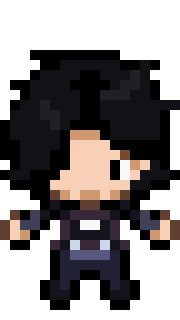

### Hi there 👋, Welcome!

  

Hello! 👋🏻 I'm a 6th-semester Software Engineering student. 🏫

I have a strong interest in software architecture, always thinking about building projects with **scalability and maintainability** in mind. I often enjoy solving my own day-to-day problems by creating practical software tools. 💻

Currently, I am diving deep into backend technologies like **Java with Quarkus**, while also learning frontend development with **Angular**. Beyond web development, I am highly enthusiastic about learning **Artificial Intelligence** and I've recently started exploring **Rust**. 🦀

I prefer working in Linux environments and I absolutely love the **Neovim workflow** for a highly efficient, mouse-free development experience. ⌨️

  

**Skills:**  
Backend (Java/Quarkus) | Frontend (Angular) | API Design | Linux Environment | Problem Solving

**Tools & Technologies:**   
    

       

 

- 🌱 **Currently learning:** Java/Quarkus, Angular, Artificial Intelligence fundamentals, Rust, and perfecting my Neovim keybindings.
- 😄 **Pronouns:** He/Him.
- ⚡ **Fun fact:** When I'm not coding, I play the guitar (everything from Radiohead to classic boleros), or play Pokémon games.

 

<!-- Social Media -->
  
 
